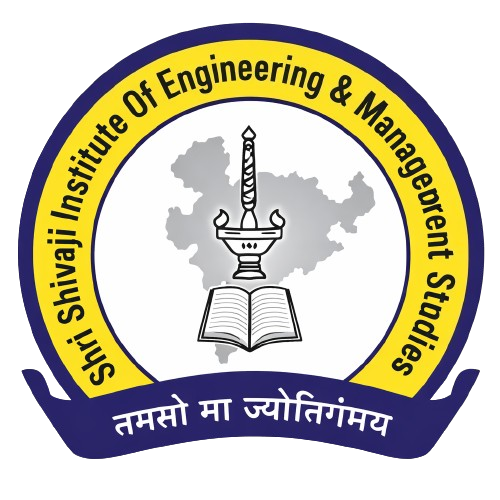
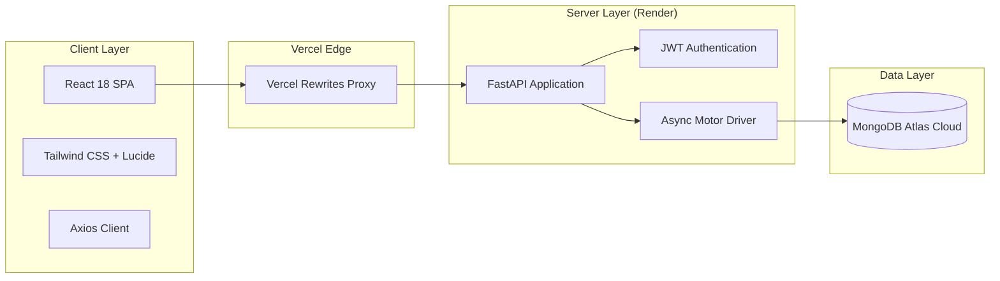

<p align="center">
  
</p>

<h1 align="center">🎓 SSIEMS CSE Academic Portal</h1>

<p align="center">
  <strong>Comprehensive Academic, Administrative & Examination Management System</strong><br>
  <em>Department of Computer Science & Engineering • Shri Shivaji Institute of Engineering and Management Studies, Parbhani</em>
</p>

<p align="center">
  <a href="https://cse-college-portal.vercel.app"></a>
  <a href="https://cse-college-portal-api.onrender.com/docs"></a>
  <a href="https://www.mongodb.com/atlas"></a>
  <a href="https://react.dev"></a>
  <a href="https://fastapi.tiangolo.com"></a>
  <a href="https://tailwindcss.com"></a>
</p>

---

## 🌐 Live Production Links

| Component | Platform | URL |
| :--- | :--- | :--- |
| **Frontend Web App** | **Vercel** | 🔗 **[cse-college-portal.vercel.app](https://cse-college-portal.vercel.app)** |
| **Backend REST API** | **Render** | 🔗 **[cse-college-portal-api.onrender.com](https://cse-college-portal-api.onrender.com)** |
| **Interactive API Docs** | **Swagger UI** | 🔗 **[cse-college-portal-api.onrender.com/docs](https://cse-college-portal-api.onrender.com/docs)** |

---

## 🔑 Demo Access & Walkthrough

The portal includes **1-Click Demo Login** buttons on the [`/login`](https://cse-college-portal.vercel.app/login) page for instant evaluation:

| Role | Demo Profile | Email | Capabilities |
| :--- | :--- | :--- | :--- |
| **Admin / HOD** | Prof. Pawar V.K. | `head.cse@ssiems.in` | Year-wise student records, faculty leave approval, department analytics, exam creation |
| **Faculty / Teacher** | Prof. Bais P. G. | `bpg@ssiems.org.in` | Apply for Casual Leave (CL), view leave status, evaluate student answer sheets |
| **Student** | Syed Asif | `asif@ssiems.org.in` | View results, semester subjects, department announcements, syllabus |

---

## ✨ Key Features & Modules

### 1. 🏛️ Public Department Portal & Showcase
- **Institutional Branding**: Official SSIEMS identity, NAAC A+ accreditation badge, Vision & Mission statements.
- **Faculty Directory**: Complete profiles with educational qualifications (M.E, Ph.D, B.Tech), designations, and experience.
- **Interactive Campus Gallery**: High-resolution image showcase categorized by events, laboratories, classrooms, and seminars.

### 2. 👨‍💼 HOD / Admin Dashboard
- **Year-Wise Student Directory**: Organized view of enrolled students segmented by **Second Year (SY)**, **Third Year (TY)**, and **Final Year (BE)** with live search, class filters, and roll numbers.
- **Faculty Leave Management (CL System)**:
  - Real-time leave application queue.
  - Review leave dates, duration, and reason submitted by department faculty.
  - **1-Click Approve / Reject** workflow with immediate status sync.
- **Department Analytics**: Real-time counts of active students, teachers, registered subjects, and examinations.

### 3. 👩‍🏫 Faculty & Teacher Workspace
- **Casual Leave (CL) Portal**: Submit leave requests specifying start/end dates, leave type, and detailed reasons; monitor pending, approved, or rejected status in real-time.
- **Examination & Answer Sheet Evaluation**: Digital grading workflow with marks entry and feedback generation.
- **Class Lists**: Access class-wise student rosters for mentoring and academic tracking.

### 4. 🎓 Student Experience
- **Result & Grade Tracking**: View examination scores, subject credits, and academic performance history.
- **Curriculum & Subjects**: Direct access to enrolled course information and departmental notifications.

---

## 🏗️ Architecture & Technology Stack



- **Frontend**: React 18, Tailwind CSS, Lucide React, Craco, Sonner Toaster.
- **Backend**: Python 3.10+, FastAPI, Uvicorn, Motor (Async MongoDB), PyJWT, Pydantic v2.
- **Database**: MongoDB Atlas cloud cluster (`exam-management`).
- **DevOps & Infrastructure**: 
  - Vercel automated CI/CD for single-page application and seamless `/api/*` rewrite proxying.
  - Render Docker deployment with dynamic `$PORT` binding.

---

## 📁 Repository Structure

```text
CSE-College-Portal/
├── frontend/                     # React Single Page Application
│   ├── public/                   # Static assets, gallery, and college branding
│   ├── src/
│   │   ├── components/           # UI views (LandingPage, Dashboards, Login, Leave)
│   │   ├── config.js             # Environment-aware API configuration
│   │   ├── App.js                # Role-based route definitions
│   │   └── index.js              # Application entrypoint
│   ├── vercel.json               # Vercel proxy & rewrite configuration
│   └── package.json
├── backend/                      # FastAPI Python Application
│   ├── server.py                 # REST API endpoints & business logic
│   ├── requirements.txt          # Python runtime dependencies
│   ├── Dockerfile                # Production container specification
│   └── .env.example              # Sample environment template
├── Dockerfile                    # Root multi-stage Docker build configuration
├── vercel.json                   # Root Vercel multi-service configuration
└── README.md                     # Project documentation
```

---

## 💻 Local Setup & Development

### Prerequisites
- **Node.js**: v18+ and `yarn` or `npm`
- **Python**: v3.10+
- **MongoDB**: Local MongoDB instance or free MongoDB Atlas URI

### 1. Clone the Repository
```bash
git clone https://github.com/SyedAsif7/CSE-College-Portal.git
cd CSE-College-Portal
```

### 2. Backend Setup
```bash
cd backend
python -m venv .venv

# On Windows:
.venv\Scripts\activate
# On macOS/Linux:
source .venv/bin/activate

pip install -r requirements.txt
```

Create a `.env` file in `backend/`:
```env
MONGO_URL=mongodb+srv://<username>:<password>@<cluster>.mongodb.net
DB_NAME=exam-management
JWT_SECRET=your-secure-secret-key
```

Run the backend development server:
```bash
uvicorn server:app --host 0.0.0.0 --port 8000 --reload
```

### 3. Frontend Setup
In a new terminal window:
```bash
cd frontend
yarn install
yarn start
```
The application will launch at `http://localhost:3000`.

---

## 👨‍💻 Developer & Maintainer

<p align="left">
  <strong>Syed Asif</strong><br>
  <em>Lead Developer & Full Stack Architect</em>
</p>

[](https://www.linkedin.com/in/the-syed-asif)
[](https://github.com/SyedAsif7)

---

<p align="center">
  <sub>Built with ❤️ for Department of Computer Science & Engineering, SSIEMS.</sub>
</p>
